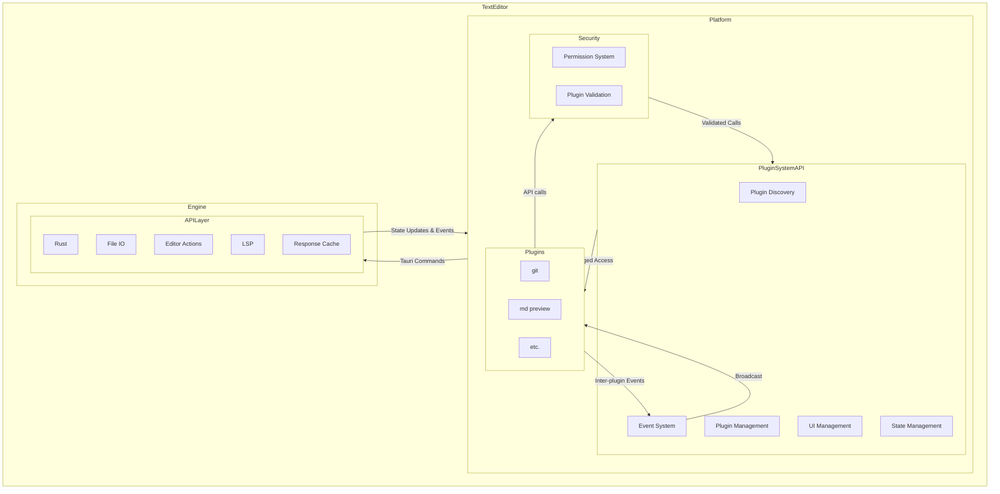

```mermaid
graph TD
    subgraph TextEditor
        subgraph Platform
            subgraph PluginSystemAPI
                disc[Plugin Discovery]
                mang[Plugin Management]
                ui[UI Management]
                state[State Management]
                events[Event System]
            end
            subgraph Plugins
                git
                md[md preview]
                etc.
            end
            subgraph Security
                perm[Permission System]
                valid[Plugin Validation]
            end
        end

        subgraph Engine
            subgraph APILayer
                eLang[Rust]
                f[File IO]
                e[Editor Actions]
                l[LSP]
                cache[Response Cache]
            end
        end
    end

    Platform -->|Tauri Commands| APILayer
    APILayer -->|State Updates & Events| Platform
    Plugins -->|API calls| Security
    Security -->|Validated Calls| PluginSystemAPI
    PluginSystemAPI -->|Managed Access| Plugins
    Plugins -->|Inter-plugin Events| events
    events -->|Broadcast| Plugins
```